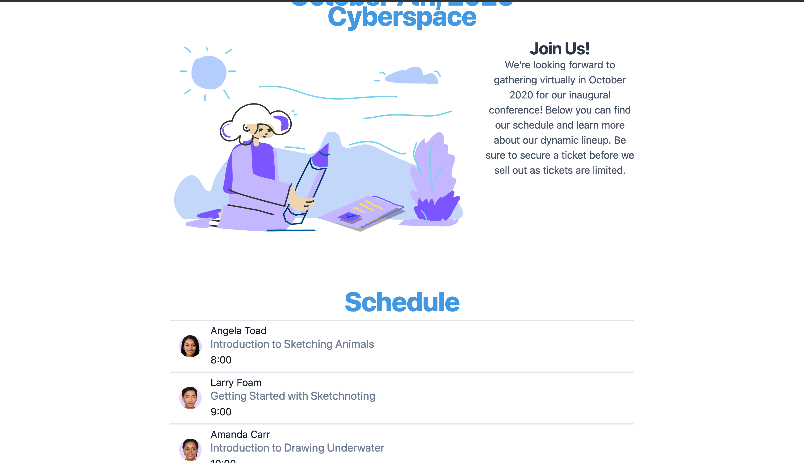

# 07 • Render Speaker/Talk Data Type

## Background 📚

As we've seen in earlier exercises `data` from GraphQL static queries can be used as `props` in components to render data. Now that we have speaker data available in GraphQL we can use that data throughout the application.

The speaker data in this application in yaml is structure liked:

```
- name: "Angela Toad"
  title: "Introduction to Sketching Animals"
  time: "12:00"
  avatar: "woman-generated-avatar-1.png"

- name: "Larry Foam"
  title: "Getting Started with Sketchnoting"
  time: "10:00"
  avatar: "man-generated-avatar-1.png"
```

and returns data in this shape from GraphQL

```
{
"data": {
  "allSpeakersYaml": {
    "edges": [
      {
        "node": {
          "id": "d1251971-3091-5906-a241-e66474a66273",
          "avatar": "woman-generated-avatar-1.png",
          "name": "Angela Toad",
          "title": "Introduction to Sketching Animals",
          "time": "12:00"
        }
      },
      {
        "node": {
          "id": "79791060-9578-5381-b772-4678f8e833f6",
          "avatar": "man-generated-avatar-1.png",
          "name": "Larry Foam",
          "title": "Getting Started with Sketchnoting",
          "time": "10:00"
        }
      }
    ]
  }
},
}
```

## Exercise 🤓

- Render high-level talk information (talk/speaker name/time/avatar) on the index page.
- Add a link to the navigation with an anchor link to the schedule

## Preview of Finished Exercise:



## Starter Code

- Import the `TalkCard` component from `src/components/talkCard` into the `index.js` page and pass in talk information (speaker name, time, title, avatar) as props.

## Files 🗂

- `src/components/talkCard`
- `src/pages/index.js`


## Example Solution Code
- [Exercise 7 - Display Speaker Data](https://github.com/M0nica/gatsby-workshop/pull/10/files)

## Example Solution Demo
- https://deploy-preview-10--gatsbyjsdemo.netlify.app/

